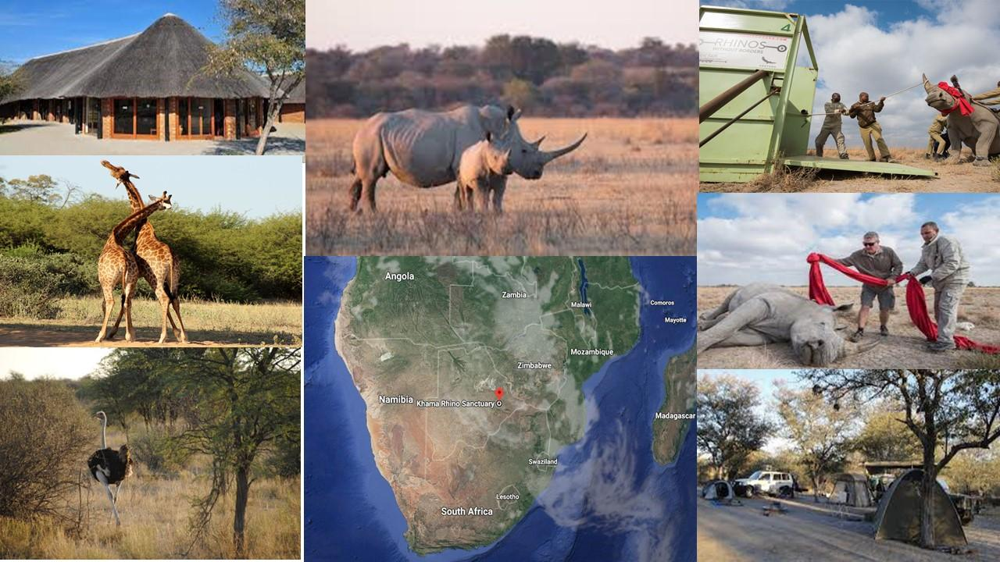
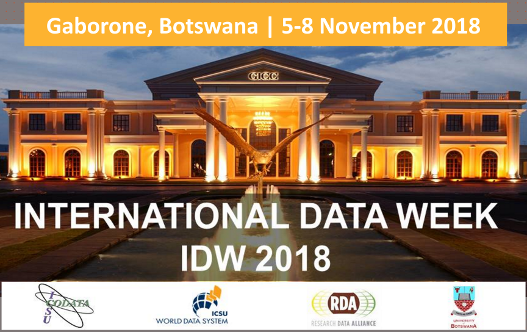

#  International Data Week ([main site](http://internationaldataweek.org/))

Remotely Piloted Aircraft Systems (RPAS, also known as small Unmanned Aerial Systems sUAS or colloquially as drones) are rapidly becoming a ubiquitous tool across a wide range of public and private sectors, from Disaster management and Search and Rescue, through to medical services, Earth Science Research, Geomatics, Agriculture, and Policing.  As platforms for scientific data collection, sUAS offer advantages such as the collection of higher spatial and/or temporal resolution data; reduced impact on the environment being monitored; lowered risk to workers and equipment involved in data collection; access to otherwise inaccessible data – all often at a lower cost than traditional methods might incur.  Further, their ability to cover tens of kilometers for relatively low cost and in rough terrain make them a valuable technology for accessing areas with little infrastructure.  As a result in many cases the developing world is leading the way in RPAS based solutions, and consequently is a key theme to address at IDW2018.  In addition to the conference sessions 2 events are being planned for co-location with IDW: a week of collaborative flying and a datathon tackeling the issues of data management and RPAS.

##  Flying week
* **dates:** 29 oct - 2 november 2018
* **location:** outside gabarone botswana
* **who:** researchers using RPAS to capture data
* **why:** networking, collaboration, learning, research
* [**Provisional program**](FW_program.md)

#  Datathon
* **dates:** 9 november 2018
* **location:** University of Botswana, Gabarone
* **who:** Researchers just considering or just begining to use RPAS to capture data
* **why:** networking, collaboration, learning, research
This 1-day practical training and multithemed datathon will be hosted by the University of Botswana.  The morning will see training modules presented addressing good RPAS data curation and processing practices.  The afternoon will be dedicated to tutor facilitated exercises.  That lead attendees through either an imagery based pipeline (eg 3d model creation) or an insitu sensor based pipeline (eg atmospheric temperature profiles).

[back](./)
