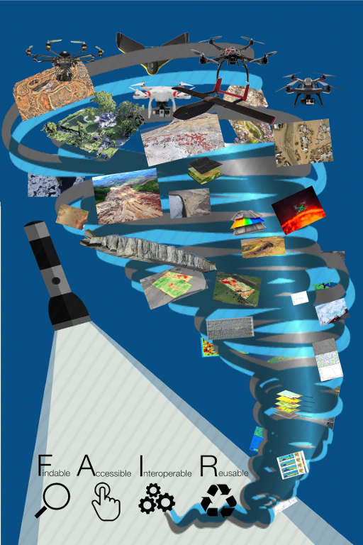

# About

Community page to work on developing RPAS best data management practices.

Remotely Piloted Aircraft Systems (RPAS) or small Unmanned Aircraft Systems (sUAS) (aka “drones”) have rapidly spurred the development of services across all sectors. From Agriculture, Mining, Conservation, Earth Sciences, and Disaster response, through to Urban Planning, Medical cargo delivery, Search and Rescue, and Police work. For those domains in which the service is primarily about data delivery or information provision there is no common approach to data management leaving users to roll their own solutions internally. This is both costly in terms of development time, and results in unknown data quality, poor data publication, and limited to zero data reuse.

[FAIR (Findable Accessible Inter-operable and Reusable)](https://www.nature.com/articles/sdata201618) - and sometimes open data - is increasingly becoming a requirement of operation in multiple sectors including academia, government, and NPOs. FAIR data in general offers the potential for both greater knowledge gains (through data reuse) and improved transparency and accountability in all sectors. FAIR RPAS data specifically, offers these gains in a context in which the democratisation of access to GIS data is unfolding. The potential of RPAS to provide highly valuable data to all sectors of society make it all the more important to making FAIR RPAS data the norm. To achieve FAIR RPAS data, however, requires infrastructure development which in-turn depends on community agreed best practices, we are working to facilitate this conversation and the building of necessary open tools to support FAIR RPAS data.

## [International Data Week](docs/idw.md)

